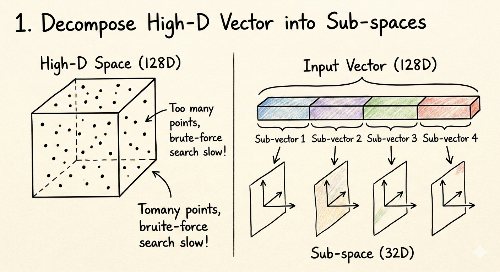
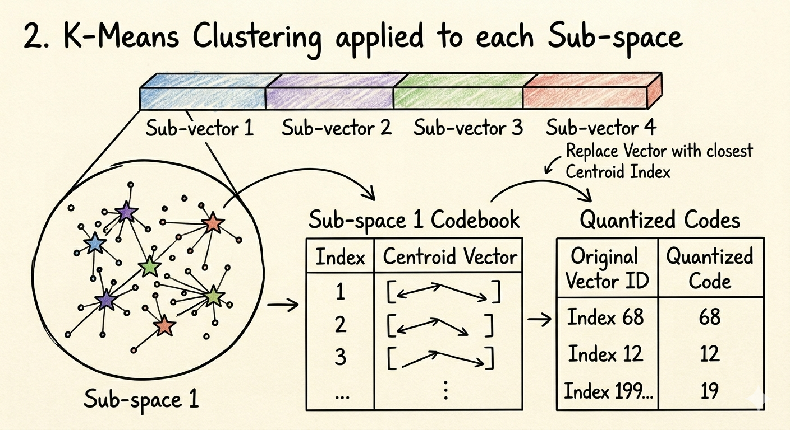
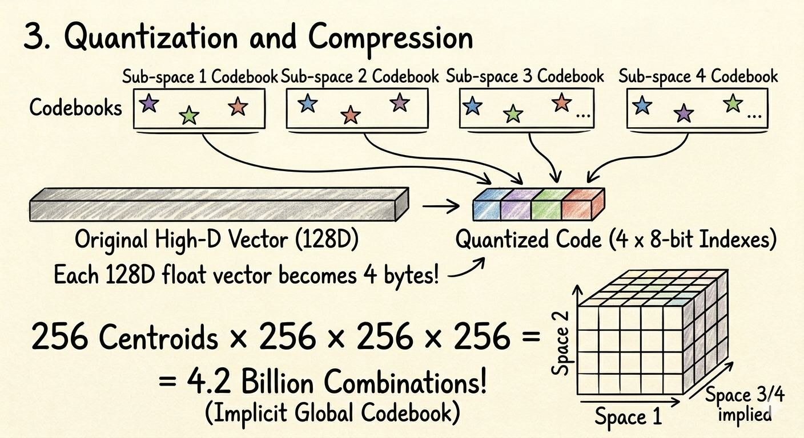
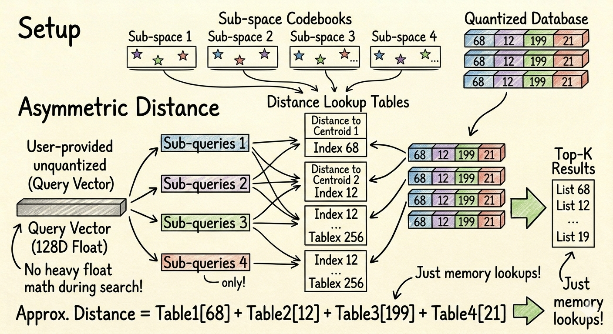

# Vector Database：从数学原理到工程落地

本文系统梳理向量数据库与向量检索的核心技术，涵盖：

- Embedding、相似度度量、ANN（Approximate Nearest Neighbor）的数学原理
- 不同数据规模、延迟预算、内存预算下的索引选型（Flat / HNSW / IVF / PQ / IMI）
- 向量库在生产系统中的真实形态：索引、存储、过滤、更新、分片与评估

---

## 1. Embedding（向量表示）

### 1.1 Embedding 的本质：把语义映射到向量空间

给定一个输入 $x$（文本/图片/代码/用户画像等），embedding 模型 $f(\cdot)$ 输出一个向量：

$$
\mathbf{v} = f(x) \in \mathbb{R}^{d}
$$

语义相近的样本在向量空间里距离更近/相似度更高。向量数据库的核心操作：

- **存**：持久化大量 $\mathbf{v}_i$（以及元数据）
- **找**：给定 query 向量 $\mathbf{q}$，在 $N$ 个向量里找 Top‑k 最近邻

### 1.2 Embedding 维度、范数与归一化

- **维度 $d$**：越大表达能力通常越强，但存储与计算成本更高（计算通常是 $O(d)$）。
- **范数 $\|\mathbf{v}\|$**：不同模型输出的范数分布可能差异很大；范数会影响 dot product 与 L2 的意义。
- **归一化（normalize）**：

$$
\hat{\mathbf{v}}=\frac{\mathbf{v}}{\|\mathbf{v}\|_2}
$$

归一化到单位球面后，"角度/方向"成为主要信息，cosine 与 L2 的关系变得等价（见 2.3）。

**工程经验（RAG 场景）**：

- 使用 cosine similarity 时，通常预先统一做 normalize，避免范数差异造成召回偏置。
- 使用 dot product（MIPS）时，是否 normalize 取决于语义定义：只关心"方向相近"还是"方向相近且范数大更重要"。

---

## 2. Similarity（相似度/距离度量）

向量检索的核心是度量"两个向量有多近/多相似"。常用度量：

| 度量                       | 类型               | 目标   | 归一化要求       |
| -------------------------- | ------------------ | ------ | ---------------- |
| L2 距离（Euclidean）       | 距离（越小越好）   | $\min$ | 无               |
| 内积（Dot product / MIPS） | 相似度（越大越好） | $\max$ | 无（范数有语义） |
| 余弦相似度（Cosine）       | 相似度（越大越好） | $\max$ | 建议预先归一化   |
| L1 距离（Manhattan）       | 距离（越小越好）   | $\min$ | 无               |
| Hamming 距离               | 距离（越小越好）   | $\min$ | 二值向量专用     |

**核心结论**：很多"看起来不同"的度量，在特定条件下可以互相转化。理解这些转化关系，是读懂"为什么某些库默认用 L2 也能做 cosine"、"为什么 MIPS 比 L2 NN 更难做 ANN"的关键。

---

### 2.1 L2 Distance（欧氏距离）

**定义**：

$$
d_2(\mathbf{x},\mathbf{y})=\|\mathbf{x}-\mathbf{y}\|_2 = \sqrt{\sum_{i=1}^{d}(x_i - y_i)^2}
$$

平方形式（squared L2）更常用于推导和计算（避免开方，保序）：

$$
\|\mathbf{x}-\mathbf{y}\|_2^2
=\|\mathbf{x}\|_2^2+\|\mathbf{y}\|_2^2-2\,\mathbf{x}\cdot\mathbf{y}
$$

**几何直觉**：L2 度量向量端点在欧氏空间中的绝对距离，同时感知"方向差异"和"长度差异"。

**性质**：

- 满足距离公理（非负、对称、三角不等式）
- 对向量缩放敏感：$d_2(\alpha\mathbf{x}, \alpha\mathbf{y}) = \alpha \cdot d_2(\mathbf{x}, \mathbf{y})$
- 高维空间中存在"维度灾难"（见 2.6）

**适用场景**：原始特征差异本身有意义时（如坐标距离、差值有物理含义）；FAISS 等库的默认索引类型。

**与 cosine 的关键关系**：若所有向量已归一化到单位球（$\|\mathbf{x}\|=\|\mathbf{y}\|=1$），则：

$$
\|\mathbf{x}-\mathbf{y}\|_2^2 = 2 - 2\cos\theta \implies \min d_2 \;\Leftrightarrow\; \max \cos\theta
$$

---

### 2.2 Dot Product（内积 / MIPS）

**定义**：

$$
s(\mathbf{x},\mathbf{y})=\mathbf{x}\cdot\mathbf{y}=\sum_{i=1}^{d}x_i y_i = \|\mathbf{x}\|_2\|\mathbf{y}\|_2\cos\theta
$$

这个分解式揭示了 dot product 的本质：**长度 × 长度 × 方向一致性**。

**MIPS（Maximum Inner Product Search）目标**：

$$
\arg\max_{\mathbf{x}\in\mathcal{D}}\; \mathbf{q}\cdot\mathbf{x}
$$

**为什么 MIPS 比 L2 NN 更难做 ANN？**

L2 NN 满足一个关键几何性质：若 $\mathbf{x}^*$ 是 $\mathbf{q}$ 的最近邻，则以 $(\mathbf{q}+\mathbf{x}^*)/2$ 为中心的超平面能分隔 $\mathbf{x}^*$ 与大多数其他点，ANN 算法的剪枝策略依赖这个性质。

而 MIPS **不满足三角不等式**，几何剪枝失效，无法直接套用大多数 ANN 索引。常见对策：

1. **归一化后转 cosine/L2**（最简单，丢失范数信息）
2. **向量增广转 L2**（保留范数，见 2.8）
3. **专用 MIPS 索引**（如 ScaNN 的 anisotropic quantization）

Dot product 同时感知"方向"和"长度"，范数大的向量天然有更高的内积，即使方向不那么相似。

**典型用途**：推荐系统（item 范数隐含流行度/质量信号）、广告 CTR 预估、对比学习（SimCLR / InfoNCE loss 等）。

---

### 2.3 Cosine Similarity / Cosine Distance（余弦）

**定义**：

$$
\cos(\theta) = \frac{\mathbf{x}\cdot\mathbf{y}}{\|\mathbf{x}\|_2\|\mathbf{y}\|_2} \in [-1, 1]
$$

| $\cos\theta$ 值 | 含义                     |
| :-------------: | ------------------------ |
|      $+1$       | 完全同向（语义完全一致） |
|       $0$       | 正交（无相关）           |
|      $-1$       | 完全反向（语义对立）     |

**Cosine distance**（作为距离度量使用时）：

$$
d_{\cos}(\mathbf{x}, \mathbf{y}) = 1 - \cos(\theta) \in [0, 2]
$$

注意：cosine distance 不满足三角不等式，严格来说不是"度量"，但工程中常用。

**Angular distance**（满足三角不等式的变体）：

$$
d_{\text{ang}}(\mathbf{x}, \mathbf{y}) = \frac{\arccos(\cos\theta)}{\pi} \in [0, 1]
$$

**归一化后的简化**：当 $\|\mathbf{x}\|=\|\mathbf{y}\|=1$ 时，

$$
\cos(\theta) = \mathbf{x}\cdot\mathbf{y}
$$

此时 cosine similarity 退化为普通内积，三者（cosine、dot、L2）在**排序**意义上完全等价：

$$
\max\cos\theta \;\Leftrightarrow\; \max(\mathbf{x}\cdot\mathbf{y}) \;\Leftrightarrow\; \min\|\mathbf{x}-\mathbf{y}\|_2^2
$$

**典型用途**：文本语义检索、RAG、文档相似度（只关心"方向"，不关心向量"长度"）。

---

### 2.4 三者的统一关系（归一化是关键）

```
向量是否已 L2 归一化（‖x‖ = ‖y‖ = 1）？
         │
    Yes  │  No
         │
  三者排序等价        三者不同，需明确选择
  L2 ↔ dot ↔ cosine  MIPS 更难做 ANN
```

**完整等价推导**（单位向量情形）：

$$
\|\mathbf{x}-\mathbf{y}\|_2^2
= \underbrace{\|\mathbf{x}\|_2^2}_{=1} + \underbrace{\|\mathbf{y}\|_2^2}_{=1} - 2\mathbf{x}\cdot\mathbf{y}
= 2 - 2\cos\theta
$$

因此排序等价：

$$
\arg\min_i \|\mathbf{q}-\mathbf{x}_i\|_2^2
= \arg\max_i (\mathbf{q}\cdot\mathbf{x}_i)
= \arg\max_i \cos(\mathbf{q}, \mathbf{x}_i)
$$

**工程含义**：embedding 生成后做了 `normalize`，则 FAISS 的 `IndexFlatL2` 和 `IndexFlatIP` 结果完全一致（排名相同），可以任选其一。

---

### 2.5 其他距离度量

**L1 Distance（Manhattan 距离）**：

$$
d_1(\mathbf{x},\mathbf{y}) = \sum_{i=1}^{d} |x_i - y_i|
$$

- 对异常值比 L2 更鲁棒（L2 对大误差的惩罚是平方级别）
- 稀疏特征（如词袋向量）有时用 L1
- 大多数 ANN 库对 L1 的优化不如 L2（SIMD 指令支持较弱）

**Hamming 距离**（binary 向量专用）：

$$
d_H(\mathbf{x},\mathbf{y}) = \sum_{i=1}^{d} \mathbf{1}[x_i \neq y_i]
$$

- 极快：CPU 的 `popcount` 指令（位操作，一条指令处理 64 bits）
- 常用于 Binary Quantization（BQ）embedding 的第一阶段粗筛，再用 float32 精排
- 典型应用：图像检索的 LSH（Locality-Sensitive Hashing）

**Jaccard 相似度**（集合/稀疏 binary 专用）：

$$
J(\mathbf{x},\mathbf{y}) = \frac{|\mathbf{x} \cap \mathbf{y}|}{|\mathbf{x} \cup \mathbf{y}|}
$$

- 适用于文档词袋集合、用户行为集合的相似度
- 不用于 dense embedding 检索

---

### 2.6 高维空间的"维度灾难"对度量的影响

随着维度 $d$ 增大，L2 距离会出现反直觉现象——**距离集中（concentration of measure）**：

对均匀分布在 $[0,1]^d$ 上的随机点，最近邻与最远邻的距离之比满足：

$$
\frac{d_{\max} - d_{\min}}{d_{\min}} \to 0 \quad \text{as } d \to \infty
$$

即在高维空间里，所有点"差不多一样远"，"哪个更近"变得越来越模糊。

**实践影响**：

- 维度越高，ANN 召回越难，需要更大的 `nprobe` / `ef_search`
- Cosine（方向相似性）比 L2（绝对距离）在高维下通常更稳定，因为方向差异仍有区分度
- 这是 embedding 模型做归一化、以及用 PQ/SQ 做降维的重要动机之一
- 从 $d=768$ 降到 $d=256$（用 Matryoshka embedding 或 PCA）有时能在几乎不损失 Recall 的情况下大幅减少计算量

---

### 2.7 选择度量的工程建议

| 场景                  | 推荐度量                              | 原因                                    |
| --------------------- | ------------------------------------- | --------------------------------------- |
| 文本语义检索 / RAG    | Cosine（预归一化后用 dot 或 L2 均可） | 只关心方向，范数无额外语义              |
| 推荐 / 广告召回       | Dot product（MIPS）                   | 范数隐含热度/质量信号                   |
| 多模态检索（CLIP 等） | Cosine                                | 模型训练目标即 cosine，或输出已归一化   |
| 人脸识别 / 度量学习   | L2                                    | ArcFace / CosFace 损失天然优化 L2 空间  |
| 二值化 embedding 粗筛 | Hamming                               | `popcount` 极快，适合大规模第一阶段过滤 |
| 稀疏词袋特征          | L1 / Jaccard                          | 稀疏集合语义更自然                      |

**最常见的工程陷阱**：

> **度量不一致（Metric mismatch）**：embedding 模型用 cosine 训练，向量库用 L2 索引，且向量未归一化 → 召回严重下降。

正确流程：

```
embedding 生成 → 归一化（若模型需要）→ 入库 → 索引度量与上游保持一致
```

具体建议：

- 查阅 embedding 模型的官方文档确认推荐度量（`text-embedding-3-large`、E5 系列、BGE、OpenAI Ada 002 均推荐 cosine）
- 无法确认时，**归一化 + L2 是最稳妥的兜底策略**（归一化后三者等价）
- 切勿在不同批次用不同的归一化策略混用同一个索引

---

### 2.8 MIPS 如何转为 L2

很多 ANN 索引（HNSW、IVF 等）的理论和实现更适配 L2；但实际业务常需要 MIPS（dot product）。将 MIPS 转成等价 L2 问题是标准技巧。

**方案一：归一化（信息有损）**

对所有向量 $\mathbf{x}$ 做 $\mathbf{x} \leftarrow \mathbf{x}/\|\mathbf{x}\|$，然后用 L2 索引。排序等价于 cosine，但**丢失了范数信息**。若范数有业务含义，不可用。

**方案二：向量增广（信息无损）**

经典 ALSH（Asymmetric LSH for MIPS）方法，假设数据向量范数有上界 $\|\mathbf{x}\| \le R$：

$$
\hat{\mathbf{x}} = \left[\mathbf{x};\; \sqrt{R^2 - \|\mathbf{x}\|_2^2}\right] \in \mathbb{R}^{d+1},\quad
\hat{\mathbf{q}} = [\mathbf{q};\; 0] \in \mathbb{R}^{d+1}
$$

则：

$$
\|\hat{\mathbf{q}}-\hat{\mathbf{x}}\|_2^2
= \|\mathbf{q}\|_2^2 + R^2 - 2\,\mathbf{q}\cdot\mathbf{x}
$$

在固定 $\mathbf{q}$ 和 $R$ 的情况下，$\|\mathbf{q}\|_2^2 + R^2$ 为常数，因此：

$$
\arg\min_{\mathbf{x}}\; \|\hat{\mathbf{q}} - \hat{\mathbf{x}}\|_2^2 = \arg\max_{\mathbf{x}}\; \mathbf{q}\cdot\mathbf{x}
$$

代价：维度从 $d$ 增加到 $d+1$（几乎无感知）；需确保所有向量范数有界（若无界需先做缩放）。

**方案三：专用 MIPS 索引**

Google ScaNN 的 **anisotropic quantization** 在量化时对内积方向施加更大权重，原生优化 MIPS；Qdrant 等库提供原生 dot product 索引（内部仍用 HNSW，但距离函数改为 $-\mathbf{q}\cdot\mathbf{x}$，转为最小化问题）。

---

## 3. Similarity Search（相似度检索）

给定向量集合 $\{\mathbf{x}_i\}_{i=1}^N$ 和 query 向量 $\mathbf{q}$，检索 Top‑k 的数学形式是：

$$
\text{TopK}(\mathbf{q})=\operatorname{arg\,topk}_{i\in[1..N]}\ \text{sim}(\mathbf{q},\mathbf{x}_i)
$$

其中 $\text{sim}$ 可以是 cosine/dot，或者用距离 $d$ 的负数。

在实际工程中，检索过程面临三个约束的权衡：**召回率**、**检索速度**、**内存占用**，三者无法同时完全满足，通常以牺牲精度换取速度。

### 3.1 精确搜索（Exact NN）

#### 3.1.1 Brute Force（Flat 扫描）

做法：对每个 $\mathbf{x}_i$ 计算一次相似度，取 Top‑k。

- 时间复杂度：$O(Nd)$
- 优点：精确；实现最简单；没有建索引时间
- 缺点：数据大时延迟不可控

Flat 常被低估：

- 小规模（<100k）非常好用
- 即使规模更大，配合 SIMD/GPU 与批量查询也能很强

#### 3.1.2 KNN（k‑Nearest Neighbors）

KNN 是"结果定义"（找最近的 k 个），不等于某个具体算法。Brute force 是实现 KNN 的一种方式；ANN 则是常用的近似实现方式。

### 3.2 近似搜索（ANN：Approximate NN）

ANN 的目标是在可接受的 recall 损失下，显著降低查询时间/内存成本。

核心 trade‑off：

- **Recall vs Latency**：更高的召回通常意味着更慢
- **Memory vs Latency**：图索引/高参数通常更快但更吃内存
- **Build Cost vs Query Cost**：某些索引训练/构建昂贵但查询便宜（如 IVF/PQ）

---

## 4. ANN 的主流算法族

业界常见 ANN 可以按索引结构分为四类：

1. 空间划分（KD‑Tree / Ball‑Tree / LSH）
2. 聚类 + 倒排（IVF / IMI）
3. 图结构（NSW / HNSW）
4. 压缩与量化（SQ / BQ / PQ / OPQ 等，常与 IVF 组合）

### 4.1 基于空间划分

#### 4.1.1 KD‑Tree

思想：递归按某一维把空间二分，形成树；查询时用回溯剪枝减少访问节点。

- 适用维度：低维效果好；高维退化严重（维度灾难）
- 工程结论：现代 embedding 常见 384/768/1024 维，KD‑Tree 通常不作为主力 ANN（除非做特征降维或任务是低维）。

#### 4.1.2 Ball Tree

思想：用球（中心 + 半径）包住一组点，查询时用三角不等式剪枝。

相较 KD‑Tree，对某些数据分布更友好，但高维同样会退化。

#### 4.1.3 LSH（Locality Sensitive Hashing，局部敏感哈希）

LSH 是一类将高维向量映射到低维 hash bucket 的技术，核心性质：**相似的向量以高概率落入同一个 bucket，不相似的向量以低概率碰撞**。

**基本原理（以 L2-LSH 为例）**

选取一组随机投影向量 $\mathbf{a}_1,\ldots,\mathbf{a}_L \sim \mathcal{N}(0, I)$，以及随机偏移 $b_l \sim \text{Uniform}[0, w]$，hash 函数定义为：

$$
h_l(\mathbf{x}) = \left\lfloor \frac{\mathbf{a}_l \cdot \mathbf{x} + b_l}{w} \right\rfloor
$$

其中 $w$ 为桶宽。两个向量 $\mathbf{x}, \mathbf{y}$ 碰撞概率随其 L2 距离单调递减：

$$
\Pr[h_l(\mathbf{x}) = h_l(\mathbf{y})] = f\!\left(\frac{d_2(\mathbf{x}, \mathbf{y})}{w}\right)
$$

**Cosine-LSH（SimHash）**

适用于 cosine 相似度，使用随机超平面划分：

$$
h(\mathbf{x}) = \text{sign}(\mathbf{a} \cdot \mathbf{x}), \quad \mathbf{a} \sim \mathcal{N}(0, I)
$$

两向量碰撞概率：

$$
\Pr[h(\mathbf{x}) = h(\mathbf{y})] = 1 - \frac{\theta(\mathbf{x}, \mathbf{y})}{\pi}
$$

其中 $\theta$ 为两向量夹角。

**多表策略（Amplification）**

单个 hash 函数的区分度有限，工程中使用 $L$ 张独立哈希表，每张表用 $K$ 个 hash 函数级联：

```
查询 q 时，计算 L 张表各自的 bucket
取所有命中 bucket 的并集作为候选集
对候选集做精确距离排序
```

- $K$ 增大 → 精度提升（减少误报），但候选集变小（漏报增加）
- $L$ 增大 → 召回提升（更多候选），但内存和查询时间增大

**LSH 的工程定位**

| 维度     | LSH                        | HNSW / IVF         |
| -------- | -------------------------- | ------------------ |
| 原理     | 随机投影 + 哈希            | 图导航 / 聚类      |
| 理论保证 | 有（概率界）               | 无（经验性）       |
| 实际性能 | 通常逊于 HNSW/IVF          | 工程性能更强       |
| 内存效率 | 多表导致内存开销大         | HNSW 高，IVF‑PQ 低 |
| 适用场景 | 流式/在线 hash、二值化粗筛 | 离线建库，批量检索 |

LSH 在现代 dense embedding 检索中已基本被 HNSW 和 IVF‑PQ 取代，但在 **Binary Quantization 的粗筛阶段**（SimHash + Hamming 距离）仍有应用，另外在文本去重（MinHash/SimHash）、流式数据等场景中依然常见。

---

### 4.2 基于聚类划分：IVF / IMI

这条路线的核心思路是：先粗召回，再细计算。

#### 4.2.1 IVF（Inverted File Index）

核心思想：

- 先训练一个粗量化器（coarse quantizer），把空间划分成 $n_{\text{list}}$ 个簇（centroids）
- 每个向量 $\mathbf{x}$ 被分配到最近的 centroid 对应的倒排表（list）中
- 查询时只探测 $n_{\text{probe}}$ 个最相关的 lists，再在桶内暴力检索

关键参数：

- **nlist**：簇的数量（倒排桶数量）
  - nlist 大：每个桶更小，查询更快，但训练/构建成本更高，且需要更精细的探测策略
- **nprobe**：查询时探测多少个桶
  - nprobe 大：recall 高但更慢

复杂度直觉：

- 把全库从 $N$ 缩小到候选集大小 $C\approx N\cdot \frac{n_{\text{probe}}}{n_{\text{list}}}$，然后在候选集里再做更精确的距离计算。

工程常识：

- IVF 非常适合 1M+ 规模，并且能很好地和 PQ 组合（IVF‑PQ）。
- IVF 对训练数据分布较敏感：训练向量与线上向量分布偏移会导致 recall 降低。

#### 4.2.2 IMI（Inverted Multi‑Index）

IMI 将粗量化器做成乘积结构，用多个子空间的笛卡尔积构造更细粒度的桶，在超大规模下获得更高的划分分辨率。

工程定位：

- IMI 更偏"极大规模、强工程团队"的路线（训练/实现更复杂）
- 许多现代系统在可接受的硬件下，优先用「IVF‑PQ + 分片」而不是 IMI

---

### 4.3 基于图结构：NSW / HNSW

这条路线的核心思路是：用图的"近邻导航"快速逼近目标。

#### 4.3.1 NSW（Navigable Small World）

将向量作为节点，边连接若干近邻；查询时从入口点开始做贪心搜索（不断走向更相近的节点），利用小世界网络的短路径性质快速到达近邻区域。

NSW 面临两个问题：

1. **早期节点连接过多**：构建顺序导致早插入的节点成为"枢纽"，图结构不均匀
2. **局部最优陷阱**：贪心搜索可能陷入次优解

#### 4.3.2 HNSW（Hierarchical NSW）

HNSW 在 NSW 上增加多层结构，解决上述两个问题：

- **上层**更稀疏、跨度更大，用于快速跳转到大概区域（类似跳表）
- **越往下层越稠密**，用于精细搜索

**插入算法（简述）**：

1. 随机确定该节点的最高层 $l \sim \lfloor -\ln(\text{Uniform}[0,1]) \cdot m_L \rfloor$
2. 从顶层入口出发，向下逐层贪心搜索，找到每层的最近邻候选
3. 在 $[0, l]$ 层分别选取 $M$（或 $M_0$）个最近邻连边
4. 若某节点出度超过 $M$，用启发式裁边（保留"多样化"的邻居）

关键参数：

- **M**：每个节点的最大连接数（出度）
  - M 大：图更密、recall 更高/更快，但内存更大、构建更慢
  - 常用值：M=16（通用）、M=32（更高精度需求）
- **efConstruction**：构建时的候选队列大小（越大构建质量越高，但构建更慢）
  - 典型值：efConstruction=200
- **efSearch**：查询时的候选队列大小（越大 recall 越高但更慢）
  - 典型值：efSearch=50~200

**HNSW 的内存占用估算**（$N=10^7, d=768, M=16$）：

| 组件                | 大小                                             |
| ------------------- | ------------------------------------------------ |
| 原始向量（float32） | $10^7 \times 768 \times 4 \approx$ 30 GB         |
| 图结构（边信息）    | $10^7 \times M \times 2 \times 4 \approx$ 1.3 GB |
| **合计**            | **~31 GB**                                       |

**删除与更新的挑战**：

HNSW 是图结构，删除一个节点会破坏图的连通性。主要策略：

- **Tombstone（软删除）**：标记删除，查询时跳过，定期重建
- **边修复**：尝试将删除节点的邻居重新连接，实现复杂
- **整图重建**：最干净，代价是停服或双写

工程结论：

- HNSW 是中等到大规模（100k～千万级）+ 低延迟 + 内存充足场景的首选
- HNSW 本质是内存换时间，动态删除需要额外策略

---

### 4.4 压缩与量化（Quantization）

目标：减少存储与带宽，同时尽量保留相似度排序的正确性。

#### 4.4.1 标量量化（Scalar Quantization / SQ）

**原理**：将每个浮点数独立映射到整数范围，是最简单的量化方式。

**int8 量化**（最常用）：

对第 $i$ 维，找到训练集在该维的最小值 $v_{\min}^{(i)}$ 和最大值 $v_{\max}^{(i)}$，然后线性映射：

$$
\hat{x}_i = \text{round}\!\left(\frac{x_i - v_{\min}^{(i)}}{v_{\max}^{(i)} - v_{\min}^{(i)}} \times 255\right) \in [0, 255]
$$

解码时反向映射（加法 + 乘法）。

**压缩率与精度**：

| 量化类型 | 每维存储  | 压缩比（vs float32） | 典型 Recall 损失 |
| -------- | --------- | -------------------- | ---------------- |
| float32  | 4 bytes   | 1×                   | 0%               |
| float16  | 2 bytes   | 2×                   | <0.1%（极小）    |
| int8     | 1 byte    | 4×                   | 0.1%~1%          |
| int4     | 0.5 bytes | 8×                   | 1%~5%            |

**SQ 的优势**：

- 实现简单，SIMD 指令（AVX2/AVX-512）对 int8 加法有原生支持
- 距离计算可以完全在整数域进行（加法快于浮点）
- 与 HNSW 组合（SQ8-HNSW）：保持图结构的高 recall，同时减少 4× 内存

**SQ 的局限**：

- 压缩率有限（最多 8×），远不如 PQ（32×~64×）
- 量化范围依赖训练集分布，分布偏移会影响精度

#### 4.4.2 二值量化（Binary Quantization / BQ）

**原理**：将每个浮点数映射为 1 bit，通常以 0 为阈值：

$$
\hat{x}_i = \mathbf{1}[x_i \geq 0]
$$

得到 binary 向量后，用 **Hamming 距离**（`popcount`）替代 L2/cosine 计算。

**压缩率与性能**：

- 压缩比：float32 → binary = **32×**（768 维 → 96 bytes）
- `popcount` 指令：单条 CPU 指令处理 64 bit，比浮点距离快 **10~50×**
- Recall 损失：较大，通常需要 reranking 补偿

**工程中的标准做法——两阶段检索**：

```
阶段 1（粗筛）: binary 向量 + Hamming → 快速筛选 Top-4k 候选
阶段 2（精排）: 原始 float32 向量 + 精确距离 → 返回 Top-k
```

两阶段合并通常能以接近 BQ 的速度，达到接近 float32 的召回率。

**适用条件**：

- embedding 向量已归一化（均值接近 0）
- 高维向量（768+）效果更好（大数定律：子向量和趋近高斯分布）
- Matryoshka / Cohere Embed v3 等模型对 BQ 友好，官方提供 binary 版本

#### 4.4.3 PQ（Product Quantization，乘积量化）

**核心思想**：把高维空间的量化问题拆解为多个低维子空间的独立量化，指数级降低码本训练难度，同时实现极高压缩率。

---

**第一步：向量切分（子空间分解）**

将 $d$ 维向量均匀切成 $m$ 个子向量，每段维度为 $d^* = d/m$：

$$
\mathbf{x}=[\underbrace{\mathbf{x}^{(1)}}_{d^*\text{ dims}},\underbrace{\mathbf{x}^{(2)}}_{d^*\text{ dims}},\ldots,\underbrace{\mathbf{x}^{(m)}}_{d^*\text{ dims}}]
$$

要求 $d$ 能被 $m$ 整除；若不能整除，通常做 padding 或调整 $m$。



---

**第二步：码本训练（离线，一次性）**

对每个子空间 $j \in \{1,\ldots,m\}$，在训练集上用 **k-means** 独立训练一个码本（codebook）：

$$
\mathcal{C}^{(j)} = \{\mathbf{c}^{(j)}_1, \mathbf{c}^{(j)}_2, \ldots, \mathbf{c}^{(j)}_k\}, \quad k = 2^b
$$

其中每个 $\mathbf{c}^{(j)}_i \in \mathbb{R}^{d^*}$ 是一个 centroid。

- 码本大小 $k$：通常取 $k=256$（即 $b=8$ bits），意味着每段 1 byte
- $m$ 个子空间共有 $m \times k$ 个 centroids，总存储为 $m \times k \times d^* \times 4$ bytes

> **为什么用多个小码本而不是一个大码本？**  
> 若直接对 $d$ 维向量训 $k^m$ 个 centroids，$d=768,m=8,k=256$ 时需要 $256^8 \approx 10^{19}$ 个 centroids，完全不可行。分解后只需 $m \times k = 8 \times 256 = 2048$ 个 centroids。



---

**第三步：编码（Encoding，离线）**

对库中每个向量 $\mathbf{x}$，在第 $j$ 个子空间里找最近的 centroid：

$$
q^{(j)}(\mathbf{x}) = \arg\min_{i \in \{1,\ldots,k\}} \left\| \mathbf{x}^{(j)} - \mathbf{c}^{(j)}_i \right\|^2
$$

最终每个向量被编码为 $m$ 个整数的元组（即 PQ code）：

$$
\text{code}(\mathbf{x}) = \left(q^{(1)}(\mathbf{x}),\, q^{(2)}(\mathbf{x}),\, \ldots,\, q^{(m)}(\mathbf{x})\right)
$$

存储上，每个整数占 $b$ bits（$b=8$ 时为 1 byte），整体 code 长度为 $m \times b$ bits。



---

**压缩率分析**

| 参数       | 原始 float32       | PQ code                       |
| ---------- | ------------------ | ----------------------------- |
| 每向量存储 | $d \times 4$ bytes | $\dfrac{m \times b}{8}$ bytes |
| 压缩比     | —                  | $\dfrac{32d}{mb}$ 倍          |

典型案例对比（$b=8$）：

| 模型维度 $d$ | $m$（子段数） | 原始大小 | PQ 大小 | 压缩比  |
| :----------: | :-----------: | :------: | :-----: | :-----: |
|     768      |      96       |  3072 B  |  96 B   | **32×** |
|     768      |      48       |  3072 B  |  48 B   | **64×** |
|     1536     |      96       |  6144 B  |  96 B   | **64×** |
|     384      |      48       |  1536 B  |  48 B   | **32×** |

---

**第四步：距离近似（查询时）**

PQ 的核心加速手段：**ADC（Asymmetric Distance Computation，非对称距离计算）**。

查询向量 $\mathbf{q}$ **不量化**（保持 float32），只量化库向量。查询流程如下：

**① 预计算查表（per-query，$O(mk)$ 次距离计算）**

对每个子空间 $j$，计算查询子向量与该子空间所有 centroids 的距离，存入距离表 $T$：

$$
T[j][i] = \left\| \mathbf{q}^{(j)} - \mathbf{c}^{(j)}_i \right\|^2, \quad j=1,\ldots,m,\quad i=1,\ldots,k
$$

表大小：$m \times k$ 个浮点数，例如 $m=96, k=256$ → 仅 96×256=24,576 个 float32 = 96 KB。

**② 查表累加（per-candidate，$O(m)$ 次查表）**

对库中每个 PQ code $\text{code}(\mathbf{x})$，近似距离只需 $m$ 次查表 + 加法：

$$
\widehat{D}(\mathbf{q}, \mathbf{x}) = \sum_{j=1}^{m} T\left[j\right]\left[q^{(j)}(\mathbf{x})\right]
$$

这比直接计算 $d$ 维浮点距离快得多，且完全向量化友好（SIMD 加速）。



**ADC vs SDC 对比**

| 方式              | 查询量化？    | 库向量量化？  | 近似误差                     | 速度           |
| ----------------- | ------------- | ------------- | ---------------------------- | -------------- |
| **ADC**（非对称） | 否（float32） | 是（PQ code） | 较小（只有库向量的量化误差） | 快             |
| **SDC**（对称）   | 是（PQ code） | 是（PQ code） | 较大（双重量化误差）         | 略快，但精度差 |

生产中几乎都用 ADC。

---

**PQ 距离近似的误差分析**

真实距离与 PQ 近似距离之差的期望取决于：

- **子段数 $m$**：$m$ 越大，每段维度越低，量化误差越小；但 $m$ 也不能无限大（$d^*=1$ 时退化为标量量化）
- **码本大小 $k$**：$k$ 越大，每段量化精度越高；但训练成本为 $O(Nkd^*)$，通常 $k=256$ 是工程甜点
- **向量分布**：各子空间之间的相关性越低，PQ 效果越好（OPQ 专门解决这个问题）

---

**参数选择经验**

| 参数             | 推荐范围                    | 说明                                                |
| ---------------- | --------------------------- | --------------------------------------------------- |
| $b$（每段 bits） | 8                           | 对应 $k=256$，是 FAISS 最优化路径；其他值需手动对齐 |
| $m$（子段数）    | $d/8$ ～ $d/4$              | 保证每段维度 $d^*$ 在 4～8 之间效果最稳定           |
| 训练样本数       | $\geq 30 \times k \times m$ | 保证每个 centroid 有足够训练样本                    |

> **FAISS 建议**：`nlist`（IVF 桶数）和 `m`（PQ 子段数）满足 `m` 能整除 `d`，且 $m \leq d/2$；`nlist` 通常取 $4\sqrt{N}$ 到 $16\sqrt{N}$。

---

**Recall 与压缩比的权衡**

以 $d=768$ 为例（近似值，取决于数据分布）：

| $m$ | 压缩比 | Recall@1（近似） |
| :-: | :----: | :--------------: |
| 192 |  16×   |      ~0.95       |
| 96  |  32×   |      ~0.90       |
| 48  |  64×   |      ~0.80       |
| 24  |  128×  |      ~0.65       |

> Recall 数字仅为量级参考，实际取决于数据集和评估方式。压缩比越高，Recall 下降越显著，需通过 `nprobe`（IVF 时）或 reranking 补偿。

#### 4.4.4 OPQ（Optimized Product Quantization）

**问题来源**：PQ 假设各子空间独立，但原始 embedding 维度之间存在相关性（协方差矩阵非对角线），导致各子空间的量化误差不均匀。

**OPQ 的思路**：在 PQ 之前学习一个旋转矩阵 $\mathbf{R} \in \mathbb{R}^{d \times d}$（正交矩阵），使旋转后的向量在各子空间的能量分布更均匀、各子空间之间的相关性更低：

$$
\hat{\mathbf{x}} = \mathbf{R}\mathbf{x}
$$

然后对 $\hat{\mathbf{x}}$ 做普通 PQ。

**优化目标**：联合优化旋转矩阵 $\mathbf{R}$ 和 PQ 码本，使量化误差最小：

$$
\min_{\mathbf{R}, \{\mathcal{C}^{(j)}\}} \sum_{\mathbf{x}} \left\| \mathbf{R}\mathbf{x} - \text{PQ-decode}(\text{PQ-encode}(\mathbf{R}\mathbf{x})) \right\|^2
$$

交替优化（类似 EM）：固定 $\mathbf{R}$ 优化码本，再固定码本优化 $\mathbf{R}$。

**工程取舍**：

- OPQ 通常比 PQ 提升 1%~3% Recall（在相同压缩比下）
- 额外代价：训练时间增加（OPQ 迭代训练）；查询时多一次矩阵乘法（$\mathbf{R}\mathbf{q}$，$O(d^2)$，可忽略）
- FAISS 中对应 `IndexIVFPQR` 或先用 `PCAMatrix` + `OPQMatrix` 预处理

#### 4.4.5 IVF + PQ（IVF‑PQ）：大规模标配

IVF 解决候选集缩小，PQ 解决存储与距离计算加速，二者正交叠加。

**为什么对 Residual 做 PQ？**

IVF 将向量分配到最近的 coarse centroid $\mathbf{c}$，然后对**残差**（residual）$\mathbf{r} = \mathbf{x} - \mathbf{c}$ 做 PQ 编码。

原因：残差的分布比原始向量更集中（方差更小），PQ 量化误差更低，Recall 更高。若直接对原始向量做 PQ，不同桶的向量分布差异大，同一套码本效果较差。

**完整训练流程（离线）**

1. 在训练集上用 k-means 训练 `nlist` 个 coarse centroids（IVF 码本）
2. 将训练集向量分配到最近的 coarse centroid，计算残差
3. 在残差向量上训练 PQ 的 $m$ 个子空间码本

**完整查询流程（在线）**

```
查询向量 q
 │
 ├─① 计算 q 与所有 nlist 个 coarse centroids 的距离（O(nlist × d)）
 │   → 选出最近的 nprobe 个桶
 │
 ├─② 对 nprobe 个桶，预计算 q 的 PQ 距离表（ADC lookup table）
 │   → T[j][i] = ‖q^(j) - c^(j)_i‖² for j=1..m, i=1..k
 │
 ├─③ 遍历 nprobe 个桶内的所有 PQ codes，查表累加近似距离
 │   → 候选数通常为 nprobe × (N/nlist)
 │
 └─④ 返回近似 Top-k
      可选：用原始向量对 Top-k 做 rerank（精排）
```

**关键参数与调优**

| 参数              | 含义           | 调优方向                                                               |
| ----------------- | -------------- | ---------------------------------------------------------------------- |
| `nlist`           | IVF 桶数       | 通常取 $4\sqrt{N}$～$16\sqrt{N}$；桶太少搜索慢，桶太多每桶样本少训练差 |
| `nprobe`          | 查询时探索桶数 | 增大 → Recall↑，延迟↑；线上根据延迟 SLA 做 nprobe sweep                |
| `m`               | PQ 子段数      | 增大 → Recall↑，存储↑；需整除 $d$                                      |
| `k`（即 `nbits`） | 每段码本大小   | $k=256$（8 bit）是 FAISS 默认最优路径                                  |

**内存占用估算**（以 $N=10^7,d=768,m=96$ 为例）

| 组件                                           | 大小                                     |
| ---------------------------------------------- | ---------------------------------------- |
| PQ codes（每向量 96 B）                        | $10^7 \times 96 \approx$ **960 MB**      |
| IVF 倒排表（每向量存 coarse id）               | $10^7 \times 4 \approx$ 40 MB            |
| Coarse centroids（nlist=4096）                 | $4096 \times 768 \times 4 \approx$ 12 MB |
| PQ 码本（$96 \times 256 \times 8 \times 4$ B） | $\approx$ 8 MB                           |
| **合计（无原始向量）**                         | **~1 GB**                                |

若同时保留原始向量用于精排，额外增加 $10^7 \times 3072 \approx$ 30 GB。

**IVF‑PQ vs HNSW 快速对比**

| 维度     | IVF‑PQ             | HNSW                     |
| -------- | ------------------ | ------------------------ |
| 内存占用 | 低（压缩存储）     | 高（原始向量 + 图边）    |
| 查询延迟 | 中（nprobe 可调）  | 低（对数跳转）           |
| 构建时间 | 中（训练 + 编码）  | 高（图构建）             |
| 动态更新 | 弱（码本离线训练） | 中（可插入，删除需重建） |
| Recall   | 中（PQ 引入误差）  | 高（无量化损失）         |
| 推荐规模 | 百万～亿级         | 百万以内（内存足够时）   |

---

## 5. 向量数据库在生产里长什么样（系统视角）

一个向量数据库通常包含以下子系统：

- **Index（索引）**：HNSW/IVF‑PQ/Flat 等
- **Vector Store（向量存储）**：原始向量或压缩向量的持久化（内存 + 磁盘）
- **Metadata Store（元数据）**：doc_id、chunk_id、时间、权限、标签、tenant 等
- **Filtering（过滤）**：基于元数据的查询约束（where / filter）
- **Compute（计算）**：SIMD/GPU、多线程、批处理
- **Replication/Sharding（副本/分片）**：扩展容量与 QPS
- **Ingestion（写入流水线）**：embedding 生成、批量写入、增量更新

### 5.1 过滤（Metadata Filter）

向量检索与元数据过滤的组合是工程难点之一。ANN 索引按几何邻近组织，过滤条件按业务维度组织，两者天然不一致。

常见策略：

- **Post‑filter**：先向量 Top‑k，再按元数据过滤，不够再扩大 Top‑k
  - 简单，但可能导致延迟不稳定、recall 降低
- **Pre‑filter（bitset / posting list）**：查询时只在满足条件的集合里做 ANN
  - 需要索引实现支持（例如对 HNSW 做 bitset 过滤/多图/分区）
- **按 tenant 分库/分 collection**：最干净但资源碎片化

**过滤率对策略选择的影响**：

| 过滤率（被过滤掉的比例） | 推荐策略                        |
| ------------------------ | ------------------------------- |
| <10%（宽松过滤）         | Post-filter（扩大 Top-k 即可）  |
| 10%~80%（中等过滤）      | Pre-filter with bitset          |
| >80%（强过滤）           | 分库/分 collection 或专用子索引 |

强过滤场景（如 per-user 数据隔离）下，Post-filter 会导致有效候选集极少，召回严重不足。此时必须用分区或 Pre-filter。

### 5.2 更新与删除

不同索引对动态更新的友好度差异很大：

- **Flat**：最好（追加 + 删除标记都容易）
- **HNSW**：通常可插入；删除常用 tombstone，长期需要重建/重连边
- **IVF‑PQ**：追加可以做；但训练（nlist、PQ codebook）通常离线完成，分布漂移会影响效果

生产常见做法：

- 写入走增量 + 定期重建（nightly rebuild / rolling rebuild）
- 保留 WAL + snapshot，保证可恢复与一致性
- 双 buffer：旧索引继续服务，新索引完成构建后原子切换

### 5.3 分片与副本（Sharding & Replication）

**水平分片（Sharding）**：

当单机内存无法容纳全部向量，或 QPS 超过单机上限时，水平分片是必选项。

常见分片策略：

- **随机分片（Random / Hash-based）**：向量随机分配到各分片，查询需要广播到所有分片，汇总 Top-k 后合并排序（Scatter-Gather）
- **空间分区分片**：按向量所属 IVF 桶或 HNSW 子图分片，减少广播范围，但实现复杂
- **业务维度分片**：按 tenant、时间区间等分片，与过滤策略配合良好

**Scatter-Gather 查询**：

```
Client
  │
  ├─ Shard 0: top-k 候选 → 返回 local top-k
  ├─ Shard 1: top-k 候选 → 返回 local top-k
  └─ Shard n: top-k 候选 → 返回 local top-k
                    │
              Aggregator: merge & re-rank → 返回 global top-k
```

每个分片必须返回 local top-k（而非 top-1）才能保证全局 top-k 的正确性。实际中通常每个分片返回 top-(k × factor) 作为冗余。

**副本（Replication）**：

- 主要用于提升 QPS 和可用性，而非扩展容量
- 读副本可以直接承担查询流量
- 写入通常走主节点，副本同步（全量重建或增量 WAL 回放）

**生产规模估算示例**（$N=10^9, d=768$, IVF‑PQ, $m=96$）：

| 指标                      | 数值                                 |
| ------------------------- | ------------------------------------ |
| PQ code 总大小            | $10^9 \times 96 B \approx$ **96 GB** |
| 分片数（64 GB/分片）      | 2 个                                 |
| 每分片 QPS（1ms latency） | ~500                                 |
| 总 QPS（4 副本）          | ~4000                                |

### 5.4 DiskANN：磁盘友好的图索引

**背景**：HNSW 需要全量向量和图结构常驻内存，10 亿级别需要 TB 级内存，成本极高。DiskANN（微软 2019 年提出）将图结构和大部分向量放在 SSD，只需少量内存存放压缩版本（PQ/SQ），实现低成本的十亿级检索。

**核心设计**：

1. **In-memory Index（内存部分）**：对所有向量做 PQ 压缩，全部 PQ codes 存放在内存中，用于快速估算距离（避免磁盘读取）
2. **On-disk Graph（磁盘部分）**：完整的图结构（边信息 + 原始向量）存在 SSD，按图遍历顺序读取时局部性良好
3. **Beam Search（束搜索）**：查询时在内存 PQ codes 上做近似导航，确定需要精确计算的候选节点，再批量读取 SSD 上的原始向量

**IO 访问模式**：

```
查询 q
  │
  ├─① 内存 PQ codes 上做 beam search，确定 Top-L 候选节点（无磁盘 IO）
  │
  └─② 批量从 SSD 读取 Top-L 节点的原始向量（顺序读，SSD 友好）
       → 精确计算距离，返回 Top-k
```

**与 HNSW 对比**：

| 维度     | HNSW         | DiskANN                  |
| -------- | ------------ | ------------------------ |
| 内存需求 | 高（全量）   | 低（PQ codes 为主）      |
| 查询延迟 | 极低（<1ms） | 较低（1~5ms，含 SSD IO） |
| 适用规模 | ~1 亿以内    | 十亿级                   |
| 硬件要求 | 大内存       | 普通内存 + 高速 SSD      |

DiskANN 已被 Azure AI Search、Weaviate 等产品采用，是十亿级向量检索的主流选型之一。

---

## 6. 选型与规模经验

下面是经验推荐，前提是 embedding 维度在数百量级（384/768），延迟目标在几十到几百毫秒。

| 数据规模（向量数 N） |  延迟预算 | 内存预算 | 推荐索引                      | 原因                                 |
| -------------------- | --------: | -------: | ----------------------------- | ------------------------------------ |
| <100k                | 宽松/中等 |    低/中 | Flat（暴力）                  | 实现简单、结果精确，SIMD 足够快      |
| 100k–1M              |        低 |    中/高 | HNSW                          | 低延迟强、参数可调、工程成熟         |
| 1M–10M               |     中/低 |       中 | IVF‑PQ 或 HNSW（内存足够时）  | IVF‑PQ 省内存；HNSW 更吃内存但更快   |
| 10M–100M             |     中/低 |    中/高 | IVF‑PQ + 分片（必要时 GPU）   | 容量与吞吐更可控，便于水平扩展       |
| >1B                  |     中/严 |       低 | DiskANN / IMI + PQ / 分层存储 | 训练与系统复杂度上升，需要更强工程化 |

做系统设计时需明确四个数字：

- $N$：向量数
- $d$：向量维度
- SLA：P95/P99 延迟
- QPS：峰值并发

这四个数字决定主要精力是放在"算法优化"（索引参数）还是"系统扩展"（分片/副本/GPU/缓存）上。

---

## 7. 参数调优

### 7.1 HNSW：三个旋钮

- **M**：更大通常 recall 更高、查询更快，但内存更大（内存与 M 线性相关）
- **efConstruction**：构建质量（离线成本），通常一次性设好不再改
- **efSearch**：在线 recall/latency 的主旋钮

调优套路：

- 固定 M（16 或 32）与 efConstruction（200）离线建好
- 线上只调 efSearch 以满足 SLA 与 recall 指标
- 画出 efSearch vs Recall@10 曲线，选 "Recall 曲线拐点" 附近的值

### 7.2 IVF：nlist / nprobe 的直觉

- **nlist**：把空间切多细，影响构建复杂度和每桶平均大小
- **nprobe**：查询时探测多少个桶，是 recall-latency 的主旋钮

调优套路：

- nlist 按规模选数量级：$N \leq 10^6$ 用 nlist=1024～4096，$N \leq 10^7$ 用 nlist=4096～16384
- 每桶平均大小建议保持在 1000～5000 个向量
- 用 nprobe 在"延迟‑召回"曲线上选点：通常 nprobe = nlist / 10 作为起点

### 7.3 PQ：m 与 b 的直觉

- **m（子空间数）**：越大越精细，Recall 越高，但每向量 code 越长，内存占用越大
- **b（每段 bits）**：通常固定为 8（对应 k=256），工程成本最低

PQ 调优本质是在"内存/带宽/缓存命中"与"距离近似误差"之间找平衡。实践建议：先用 $m = d/8$ 作为基准，如果 Recall 不达标则增大 $m$；如果内存超限则减小 $m$ 或改用 HNSW+SQ8。

---

## 8. 主流向量数据库产品

### 8.1 产品全景

| 产品         | 定位            | 索引支持               | 过滤                 | 分布式          | 开源 |
| ------------ | --------------- | ---------------------- | -------------------- | --------------- | ---- |
| **FAISS**    | 库（无服务层）  | Flat/IVF/HNSW/PQ       | 无（需自建）         | 无              | ✓    |
| **Qdrant**   | 向量数据库      | HNSW + SQ/BQ/PQ        | 强（payload filter） | 分片 + 副本     | ✓    |
| **Weaviate** | 向量数据库      | HNSW（+DiskANN）       | 强                   | 分布式          | ✓    |
| **Milvus**   | 向量数据库      | IVF/HNSW/DiskANN/SCANN | 强                   | 云原生分布式    | ✓    |
| **pgvector** | PostgreSQL 扩展 | IVFFlat/HNSW           | 完整 SQL             | PostgreSQL 本身 | ✓    |
| **Pinecone** | 托管 SaaS       | 私有（基于 IVF 类）    | 有                   | 全托管          | ✗    |
| **Chroma**   | 轻量嵌入式      | HNSW（hnswlib）        | 基本                 | 无              | ✓    |
| **LanceDB**  | 嵌入式/列存     | IVF + DiskANN          | 强（Lance 格式）     | 可选云存储      | ✓    |

### 8.2 核心差异点分析

**FAISS**

纯算法库，无持久化、无网络层、无元数据管理。是绝大多数向量数据库的底层实现基础。直接使用 FAISS 意味着需要自己处理所有系统层面的问题。

```python
import faiss
import numpy as np

d = 768
n_list = 1024
m = 96

# 构建 IVF-PQ 索引
quantizer = faiss.IndexFlatL2(d)
index = faiss.IndexIVFPQ(quantizer, d, n_list, m, 8)

# 训练
index.train(train_vecs)  # train_vecs: float32 numpy array

# 添加向量
index.add(database_vecs)

# 搜索
index.nprobe = 32
distances, indices = index.search(query_vecs, k=10)
```

**Qdrant**

Rust 实现，性能稳定，过滤能力强（支持 payload 的复杂条件过滤，且过滤与向量搜索深度集成）。支持 BQ + 两阶段 rerank，是目前在 BQ 场景下最工程化的产品之一。

- 亮点：Named vectors（同一条记录存多个向量）、Sparse+Dense 混合检索
- 局限：分布式功能相对 Milvus 弱，不适合超大规模

**Milvus**

云原生架构（存算分离），计算节点无状态，数据存 S3/MinIO，适合大规模生产部署。支持多种索引类型，GPU 加速完善。

- 亮点：支持 DISKANN，GPU IVF，Sparse BM25 混合检索，读写分离
- 局限：部署复杂（依赖 etcd、S3、pulsar/kafka）

**pgvector**

直接在 PostgreSQL 中添加向量类型和 ANN 索引，优势是可以和已有 PG 业务表做 JOIN，无需维护额外系统。

```sql
-- 创建表
CREATE TABLE documents (
    id BIGSERIAL PRIMARY KEY,
    content TEXT,
    embedding VECTOR(768)
);

-- 创建 HNSW 索引
CREATE INDEX ON documents USING hnsw (embedding vector_cosine_ops)
WITH (m = 16, ef_construction = 200);

-- 向量检索 + SQL 过滤
SELECT id, content, embedding <=> '[...]' AS distance
FROM documents
WHERE metadata->>'tenant_id' = 'acme'
ORDER BY distance
LIMIT 10;
```

- 局限：HNSW 构建是单线程（pgvector 0.7.0 开始支持并行构建），超大规模时性能不如专用向量库

**LanceDB**

基于 Lance 列存格式，数据直接存在本地磁盘或 S3（无需单独服务器），适合 Serverless 和嵌入式场景。与 Arrow 生态深度集成，适合和数据处理管道联动。

### 8.3 选型建议

| 场景                             | 推荐方案                             |
| -------------------------------- | ------------------------------------ |
| 已有 PostgreSQL，规模 <10M       | pgvector（省维护成本）               |
| 新建向量服务，规模 <100M，低延迟 | Qdrant 或 Weaviate                   |
| 新建向量服务，规模 >100M，云原生 | Milvus                               |
| 超大规模（十亿+），成本敏感      | Milvus + DiskANN 或自建 FAISS + 分片 |
| 快速原型 / Notebook 实验         | Chroma 或 LanceDB                    |
| 不想运维，全托管                 | Pinecone 或 Weaviate Cloud           |
| 底层算法研究 / 定制化            | FAISS                                |

---

## 9. RAG/Agent 场景下的向量检索

向量库通常只是 RAG 的召回层，完整链路：

```text
Query
  ↓
（可选）Query Rewrite / HyDE（假设文档嵌入）/ 多查询扩展
  ↓
Hybrid Retrieval（BM25 + Vector）
  ↓
（可选）Rerank（Cross-Encoder / LLM）
  ↓
Context Assemble（去重、聚合、窗口控制）
  ↓
LLM Generate
  ↓
评估与反馈（线上指标/人工/LLM-as-judge）
```

### 9.1 Hybrid Retrieval：稀疏 + 稠密

纯向量检索在以下场景表现差：

- **专有名词/缩写**：向量空间缺乏对应语义
- **精确数字/日期**：embedding 无法区分 "2023" 和 "2024"
- **代码符号**：变量名、函数签名

BM25 对关键词精确匹配有天然优势，与向量检索互补。混合方式：

**RRF（Reciprocal Rank Fusion）**：

$$
\text{RRF\_score}(d) = \sum_{r \in R} \frac{1}{k + \text{rank}_r(d)}
$$

其中 $k$ 通常取 60，$R$ 为所有检索结果列表（如 BM25 rank list 和 vector rank list）。RRF 无需调权重，鲁棒性强，是 RAG 场景的首选融合方式。

**加权融合**（需要归一化分数）：

$$
\text{score}(d) = \alpha \cdot s_{\text{bm25}}(d) + (1-\alpha) \cdot s_{\text{vector}}(d)
$$

需要对两路分数做归一化（如 min-max），$\alpha$ 通常在 0.3~0.5 之间。

### 9.2 Reranking

第一阶段宽召回（高 recall），第二阶段精排（高 precision）：

| 方案                     | 延迟     | 效果 | 成本     |
| ------------------------ | -------- | ---- | -------- |
| Cross-Encoder（BERT 类） | 较高     | 好   | 低       |
| Cohere Rerank API        | 网络延迟 | 很好 | 按量付费 |
| LLM-as-reranker          | 高       | 最好 | 高       |
| BGE-Reranker-v2          | 中       | 好   | 低       |

Cross-Encoder 与 Bi-Encoder 的根本区别：Bi-Encoder 独立编码 query 和 document（可提前建索引），Cross-Encoder 拼接 query+document 过 encoder（更精确但无法预计算）。

### 9.3 HyDE（Hypothetical Document Embeddings）

HyDE 的思路：对于检索 recall 差的 query，先用 LLM 生成一段假设性的答案（hypothetical document），然后用这段假设答案的 embedding 去检索，而非用原始 query 的 embedding。

原理：假设答案与真实文档在向量空间中比原始问句更近（query-document gap 更小）。

适用场景：专业知识密集的检索（医疗、法律、金融），query 与文档的语言风格差异大时。

### 9.4 评估体系

完整的 RAG 评估需要同时监控两层：

**检索层指标**：

| 指标        | 含义                         |
| ----------- | ---------------------------- |
| Recall@k    | Top-k 结果中相关文档的召回率 |
| Precision@k | Top-k 结果中相关文档的占比   |
| MRR         | 第一个相关结果排名的倒数均值 |
| NDCG@k      | 考虑相关性等级的排序质量     |
| 延迟 P95    | 第 95 百分位查询延迟         |
| QPS         | 系统吞吐                     |

**生成层指标**（LLM-as-judge 或人工）：

| 指标              | 含义                         |
| ----------------- | ---------------------------- |
| Faithfulness      | 回答是否忠实于检索到的上下文 |
| Answer Relevance  | 回答是否回应了问题           |
| Context Precision | 检索到的上下文有多少是有用的 |
| Context Recall    | 相关上下文是否被检索到       |

RAGAS 是目前最常用的 RAG 评估框架，覆盖上述大部分指标，支持 GPT-4/Claude 作为评判模型。

---

## 10. 核心原理速查

**归一化后，cosine ≈ L2（排序意义上完全等价）**

推导来自单位向量的展开：$\|\mathbf{x}-\mathbf{y}\|^2 = 2-2\cos\theta$，最小化 L2 距离等价于最大化 cosine 相似度。工程含义：embedding 生成后统一 normalize，则 L2 和 cosine 索引结果相同，可任选其一。

**HNSW 是以内存换延迟**

图越密（M 越大）、候选队列越大（efSearch 越大），越容易绕开局部最优，查询越精确，但存储边和访问候选的代价也越高。相比 IVF，HNSW 的优势是延迟稳定、无需训练，劣势是内存开销大。

**IVF‑PQ 是大规模的性价比之选**

IVF 把全量 $O(Nd)$ 的暴力搜索缩减为 $O(n_\text{probe} \times N/n_\text{list} \times d)$，PQ 把 float32 距离计算替换为整数查表（节省 32× 内存，加速距离计算）。两者组合，把"全量浮点扫描"变成"少量候选 + 近似距离"，是在内存受限场景下应对百万到十亿规模的标准方案。

**量化是精度-内存的 Pareto 前沿**

SQ（4×压缩，<1% 精度损失）→ PQ（32~64× 压缩，5~20% 精度损失）→ BQ（32× 压缩，需两阶段精排）。选哪种取决于内存预算和精度 SLA：内存充足用 HNSW+float32，内存中等用 HNSW+SQ8，内存紧张用 IVF-PQ，超大规模用 DiskANN 或 BQ+rerank。
